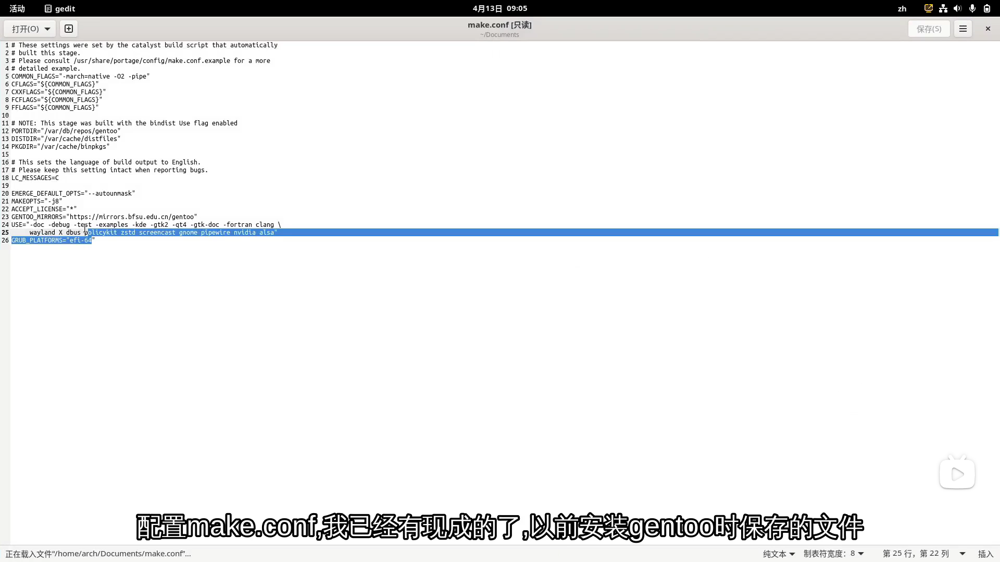

# 图片介绍：

将分别介绍该文件夹中的两张图像，并写下认为对更有用的部分。

如果需要其他部分，可以自己查看。

## 中文说明：

### 引言：

这两张截图是在`Bilibili`网站上看到的安装`Gentoo`很有帮助的`Gentoo`安装教程的图片。

已经忘记了谁发布的视频，大概已经有一段时间了。

或许是2022年前后的一段视频（？），记不清了。

### [`gentoo_make.conf.png`](https://github.com/jidro/configuration_files/blob/master/Linux_distribution_profile/Gentoo_config/Picture-Tips/gentoo_make.conf.png "gentoo_make.conf.png")



该图片是配置`make.conf`时参考的配置文件（大部分在`USE`部分）。

自己配置的`make.conf`文件，不知道为什么在配置后不断提示软件安装错误。

作为一名编程新手，对编程一无所知，对错误发生的地方一无所知。

因此，找到了一个认为稍微简单的配置，于是首先复制了该配置。

#### 内容如下：

```shell
# These settings were set by the catalyst build script that automatically
# built this stage.
# Please consult /usr/share/portage/config/make.conf. example for a more
# detailed example.
COMMON_FLAGS="-march=native -O2 -pipe"
CFLAGS="${COMMON_FLAGS}"
CXXFLAGS="${COMMON_FLAGS}"
FCFLAGS="${COMMON_FLAGS}"
FFLAGS="${COMMON_FLAGS}"

# NOTE: This stage was built with the bindist Use flag enabled
PORTDIR="/var/db/repos/gentoo"
DISTDIR="/var/cache/distfiles"
PKGDIR="/var/cache/binpkgs"

# This sets the language of build output to English.
# Please keep this setting intact when reporting bugs.
LC_MESSAGES=C

EMERGE_DEFAULT_OPTS="--autounmask"
MAKEOPTS="-j8"
ACCEPT_LICENSE="*"
GENTOO_MIRRORS="https://mirrors.bfsu.edu.cn/gentoo"
USE="-doc -debug -test -examples -kde -gtk2 -qt4 -gtk-doc -fortran clang wayland X dbus policykit zstd screencast gnome pipewire nvidia  alsa"
GRUB_PLATFORMS="efi-64"
```

### [`gentoo_dispatch-conf.png`](https://github.com/jidro/configuration_files/blob/master/Linux_distribution_profile/Gentoo_config/Picture-Tips/gentoo_dispatch-conf.png "gentoo_dispatch-conf.png")


起初，在尝试安装`Gentoo`时，屏幕上出现了这个场景，不知道该怎么做，但后来在视频中看到了这一步，意识到是这样处理的。

非常感谢这位博主的视频。当然，这些都是在[`Gentoo`的`Wiki`](https://wiki.gentoo.org/wiki/Main_Page)上有写的。

真的很感激这个视频博主。通过他的视频，第一次成功安装并使用了`Gentoo`系统。

#### 内容如下：

之后，会频繁提示更新配置文件。

当提示更新配置时，使用`dispatch-conf`进入配置并输入`u`进行更新。

##### [Gentoo Wiki](https://wiki.gentoo.org/wiki/Handbook:AMD64/Portage/Tools/zh-cn)：

`dispatch-conf`是一个帮助合并 `._cfg0000_<name>`的工具。

 `._cfg0000_<name>`是由`Portage`在要覆盖被`CONFIG_PROTECT`变量所保护的某个目录里的文件时建立的。

使用 `dispatch-conf`，能够在合并配置文件并升级更新的同时保持所有更新记录。 

`dispatch-conf`以`RCS`版本管理系统或是补丁的方式来保存配置文件间的差别。

这意味着如果在升级配置文件犯下错误时，可以随时退回到你的配置文件的之前版本。

使用 `dispatch-conf`，可以保持配置文件原来的样子，或者使用新的配置文件，还可以编辑当前文件或交互式地合并更新。

除此之外， `dispatch-conf`还有一些很棒的特性：

- 可以自动合并仅有注释变更的文件。
- 可自动合并仅有空白符数量的不同的文件。

首先编辑 `/etc/dispatch-conf.conf` ，并且创建 `archive-dir` 变量设定的目录，然后执行 `dispatch-conf`：

```shell
root # dispatch-conf
```

当运行 `dispatch-conf`的时候，程序会带你逐一查看每一个需修改配置文件。

- 按 `u` 键来用新配置文件更新（替换）现在的配置文件，然后继续处理下一个。
  
- 按 `z` 键来删除新配置文件，然后继续处理下一个。
  
- 按 `n` 键让 `dispatch-conf` 跳转到下一个文件。 这样可以将合并推迟到将来的某个时间。
  
- 按 `q` 键来退出当前配置。
  

当处理完所有的配置文件之后， `dispatch-conf`就会退出。

###### `dispatch-conf`平替：

- ① 也可以使用 [`etc-update`](https://wiki.gentoo.org/wiki/Handbook:AMD64/Portage/Tools/zh-cn#etc-update)来合并配置文件。
  
  > `etc-update`不像`dispatch-conf`那样简单易用，功能也少，但是也能提供交互式合并功能并且能自动合并一些简单的改变。
  > 
  > 不过，和`dispatch-conf`不同的是， `etc-update` ***不*** 保留配置文件的旧版本。
  > 
  > 一旦更新了文件，旧版本就永远丢失了。
  > 
  > 所以要非常小心，因为使用`etc-update` 与使用 `dispatch-conf` 相比明显的不安全。
  > 
  > 执行`etc-update`命令后：
  > 
  > 如果输入`-1`， `etc-update`将直接退出且不执行任何变更。
  > 
  > 如果输入`-3` 或者 `-5`，所有列出的配置文件将被更新的版本覆盖。
  > 
  > 因此先选出无需自动升级的配置文件非常重要，而具体步骤也很简单，只需要输入在该配置文件左边显示的数字就可以了。
  > 
  > 再之后的操作如下：
  > 
  > 如果认为升级的配置文件可以正确无误的投入使用，输入`1`。
  > 
  > 如果认为升级的配置文件是不必要的，或者也没有提供任何新的或有用的信息，输入`2`。
  > 
  > 如果想交互地升级当前的配置文件，输入`3`。
  > 
  > 当完成重要的配置文件的更新后，余下的其它配置文件就可以采用自动更新的方法了。
  > 
  > 当无法再找到任何可更新的配置文件时`etc-update`将退出。
  
- ② 也可以利用[`quickpkg`](https://wiki.gentoo.org/wiki/Handbook:AMD64/Portage/Tools/zh-cn#quickpkg)可以对系统中已安装的包进行打包归档。
  
  > 利用`quickpkg`可以对系统中已安装的包进行打包归档。
  > 
  > 这些归档文件可以作为预编译包使用。
  > 
  > 运行`quickpkg`非常简单：只要加上想要制作的软件包的名字就可以了。
  > 
  > 预编译包会保存在 `$PKGDIR` 默认为 （`/var/cache/binpkgs/`）。
  > 
  > 这些包的保存在`$PKGDIR/CATEGORY`中。
  

---

## English description：

You will introduce two images in the folder and write down what you think is more useful.

If you need other parts, you can view it yourself.

### Introduction ：

These two screenshots are pictures of the `Gentoo` installation tutorial that are helpful to install `Gentoo` on the `Bilibili` website.

It has been forgotten who released the video, probably for some time.

Maybe a video around 2022 ( ? ), I can 't remember.

### [`gentoo_make.conf.png`](https://github.com/jidro/configuration_files/blob/master/Linux_distribution_profile/Gentoo_config/Picture-Tips/gentoo_make.conf.png "gentoo_make.conf.png")


This image is the configuration file referenced when configuring `make.conf` ( mostly in the `USE` section ).

Configuring your own `make.conf` file, I do not know why the software installation errors are constantly prompted after configuration.

As a novice programmer, I know nothing about programming and the place where the error occurs.

Therefore, a configuration that is considered slightly simple was found, so the configuration was first replicated.

#### The contents are as follows ：

```shell
# These settings were set by the catalyst build script that automatically
# built this stage.
# Please consult /usr/share/portage/config/make.conf. example for a more
# detailed example.
COMMON_FLAGS="-march=native -O2 -pipe"
CFLAGS="${COMMON_FLAGS}"
CXXFLAGS="${COMMON_FLAGS}"
FCFLAGS="${COMMON_FLAGS}"
FFLAGS="${COMMON_FLAGS}"

# NOTE: This stage was built with the bindist Use flag enabled
PORTDIR="/var/db/repos/gentoo"
DISTDIR="/var/cache/distfiles"
PKGDIR="/var/cache/binpkgs"

# This sets the language of build output to English.
# Please keep this setting intact when reporting bugs.
LC_MESSAGES=C

EMERGE_DEFAULT_OPTS="--autounmask"
MAKEOPTS="-j8"
ACCEPT_LICENSE="*"
GENTOO_MIRRORS="https://mirrors.bfsu.edu.cn/gentoo"
USE="-doc -debug -test -examples -kde -gtk2 -qt4 -gtk-doc -fortran clang wayland X dbus policykit zstd screencast gnome pipewire nvidia  alsa"
GRUB_PLATFORMS="efi-64"
```

### [`gentoo_dispatch-conf.png`](https://github.com/jidro/configuration_files/blob/master/Linux_distribution_profile/Gentoo_config/Picture-Tips/gentoo_dispatch-conf.png "gentoo_dispatch-conf.png")


At first, when trying to install `Gentoo`, the scene appeared on the screen and did not know what to do, but later saw this step in the video and realized that it was handled in this way.

Thank you very much for this video.

Of course, these are written on the [`Wiki` of `Gentoo`](https://wiki.gentoo.org/wiki/Main_Page).

I really appreciate this video blogger.

Through his video, the `Gentoo` system was successfully installed and used for the first time.

#### The contents are as follows ：

After that, you are frequently prompted to update the configuration file.

When prompted to update the configuration, use `dispatch-conf` to enter the configuration and enter `u` to update.

##### [Gentoo Wiki](https://wiki.gentoo.org/wiki/Handbook:AMD64/Portage/Tools/zh-cn)：

`Dispatch-conf` is a tool that helps merge `._cfg0000_ < name >`.

 `._cfg0000_ < name >` is created by `Portage` to overwrite files in a directory protected by the `CONFIG_PROTECT` variable.

Using `dispatch-conf `, it is possible to keep a record of all updates while merging configuration files and upgrading updates. 

`Dispatch-conf` saves differences between configuration files in the form of `RCS` version control system or patches.

This means that if you make a mistake upgrading your configuration file, you can always go back to a previous version of your configuration file.

With `dispatch-conf` , you can keep the configuration file as it was, or use a new configuration file, edit the current file or interactively merge updates.

In addition to this, `dispatch-conf` has some great features：

- Files with only annotation changes can be automatically merged.
- Different files with only the number of whitespace can be automatically merged.

First edit `/etc/dispatch-conf.conf`, and create the directory set by the `archive-dir` variable, then execute `dispatch-conf`：

```shell
root # dispatch-conf
```

When running `dispatch-conf `, the program will take you side by side with each changed configuration file.

- Press the `u` key to update ( replace ) the current configuration file with the new one, and then proceed to the next one.
  
- Press the `z` key to delete the new configuration file, and then proceed to the next one.
  
- Press `n` to make `dispatch-conf` jump to the next file. This can delay the merge to a future time.
  
- Press the `q` key to exit the current configuration.
  

After processing all configuration files, `dispatch-conf` exits.

###### `dispatch-conf` replacement :

- ① You can also use [`etc-update`](https://wiki.gentoo.org/wiki/Handbook:AMD64/Portage/Tools/zh-cn#etc-update) to merge configuration files.
  
  > `Etc-update` is not as easy to use as `dispatch-conf` and has few features, but it also provides interactive merge functionality and can automatically merge some simple changes.
  > 
  > However, unlike `dispatch-conf`, `etc-update` does ***not*** keep older versions of configuration files.
  > 
  > Once the file is updated, the old version is lost forever.
  > 
  > So be very careful, because using `etc-update` is obviously not safe compared to using `dispatch-conf`.
  > 
  > After executing the etc-update command:
  > 
  > If you enter `-1`, `etc-update` will exit without making any changes.
  > 
  > If you enter `-3` or `-5`, all listed profiles will be overwritten by the updated version.
  > 
  > Therefore, it is important to select the configuration file that does not need to be automatically upgraded first, and the specific steps are as simple as entering the number displayed to the left of the configuration file.
  > 
  > After that, the operation is as follows:
  > 
  > If you think the upgraded profile can be used correctly, enter `1`.
  > 
  > If you think the upgraded configuration file is unnecessary or does not provide any new or useful information, enter `2`.
  > 
  > If you want to interactively upgrade the current configuration file, enter `3`.
  > 
  > After the update of important configuration files is completed, the remaining other configuration files can be automatically updated.
  > 
  > `Etc-update` will exit when no more updatable configuration files can be found.
  
- ② You can also use [`quickpkg`](https://wiki.gentoo.org/wiki/Handbook:AMD64/Portage/Tools/zh-cn#quickpkg) to package and archive installed packages in the system.
  
  > Using `quickpkg`, packages installed in the system can be packaged and archived.
  > 
  > These archive files can be used as precompiled packages.
  > 
  > Running `quickpkg` is very simple: just add the name of the package you want to make.
  > 
  > Precompiled packages are saved in `$PKGDIR` by default (`/var/cache/binpkgs/`).
  > 
  > These packages are saved in `$PKGDIR/CATEGORY`.
  

---
